```mermaid
erDiagram
    utilisateur ||--o{ stage : "crée"
    utilisateur ||--o{ formation : "crée"
    utilisateur ||--o{ emploi : "crée"
    utilisateur ||--o{ groupe : "crée"
    utilisateur ||--o{ membre_groupe : "appartient"
    utilisateur ||--o{ message : "envoie"
    utilisateur ||--o{ contact_organisation : "est_contact_de"
    utilisateur ||--o{ validation_formation : "valide"
    utilisateur ||--o{ validation_groupe : "valide"
    
    organisation ||--o{ contact_organisation : "a_pour_contact"
    organisation ||--o{ stage : "offre"
    organisation ||--o{ formation : "offre"
    organisation ||--o{ emploi : "offre"
    
    groupe ||--o{ message : "contient"
    groupe ||--o{ membre_groupe : "a_pour_membre"
    
    formation ||--o{ validation_formation : "fait_objet_de"
    groupe ||--o{ validation_groupe : "fait_objet_de"

    utilisateur {
        uuid id PK
        varchar nom_complet
        varchar matricule UK
        varchar email UK
        varchar titre
        varchar mot_de_passe_hash
        enum statut "etudiant, enseignant, directeur, personnel_admin, personnel_technique"
        boolean travailleur
        smallint annee_sortie
        varchar telephone
        text photo_profil_url
        varchar domaine
        enum role "user, admin, super_admin"
        timestamp created_at
        timestamp updated_at
        timestamp last_login
        boolean est_actif
    }

    organisation {
        uuid id PK
        varchar nom_organisation
        enum type_organisation "entreprise, ONG, institution_publique, startup, association"
        varchar secteur_activite
        text adresse
        varchar ville
        varchar pays
        varchar site_web
        varchar email_general
        varchar telephone_general
        text logo_url
        text description
        date date_creation
        enum statut "active, inactive, en_attente"
        timestamp created_at
        timestamp updated_at
    }

    contact_organisation {
        uuid id PK
        uuid utilisateur_id FK
        uuid organisation_id FK
        enum role_contact "representant_legal, contact_rh, contact_stage, alumni_fondateur, employe, stagiaire"
        varchar email_professionnel
        varchar telephone_professionnel
        varchar poste
        boolean est_contact_principal
        date date_debut
        date date_fin
        timestamp created_at
        timestamp updated_at
    }

    stage {
        uuid id PK
        uuid createur_id FK
        uuid organisation_id FK
        varchar titre
        varchar lieu
        varchar nom_structure
        text description
        enum type_stage "ouvrier, academique, professionnel"
        varchar email_contact
        varchar telephone_contact
        text lien_offre
        date date_debut
        date date_fin
        enum statut "active, expiree, pourvue"
        timestamp created_at
        timestamp updated_at
    }

    formation {
        uuid id PK
        uuid createur_id FK
        uuid organisation_id FK
        varchar titre
        varchar lieu
        varchar nom_structure
        text description
        enum type_formation "en_ligne, presentiel, hybride"
        boolean est_payante
        varchar email_contact
        varchar telephone_contact
        text lien_formation
        date date_debut
        date date_fin
        decimal prix
        varchar devise
        boolean est_valide
        timestamp created_at
        timestamp updated_at
    }

    emploi {
        uuid id PK
        uuid createur_id FK
        uuid organisation_id FK
        varchar titre
        varchar lieu
        varchar nom_structure
        text description
        enum type_emploi "temps_plein_terrain, temps_partiel_terrain, temps_plein_ligne, temps_partiel_ligne, hybride"
        varchar email_contact
        varchar telephone_contact
        text lien_offre
        date date_publication
        date date_expiration
        enum statut "active, expiree, pourvue"
        timestamp created_at
        timestamp updated_at
    }

    groupe {
        uuid id PK
        uuid createur_id FK
        varchar nom_groupe UK
        text photo_groupe_url
        text description
        boolean est_valide
        enum type_groupe "public, prive, administratif"
        integer max_membres
        timestamp created_at
        timestamp updated_at
    }

    membre_groupe {
        uuid id PK
        uuid utilisateur_id FK
        uuid groupe_id FK
        enum role_membre "membre, moderateur, admin"
        timestamp date_adhesion
        timestamp date_sortie
        boolean est_actif
    }

    message {
        uuid id PK
        uuid groupe_id FK
        uuid utilisateur_id FK
        text texte
        text fichier_url
        enum type_fichier "image, pdf, word, excel, powerpoint, video"
        boolean est_supprime
        timestamp created_at
        timestamp updated_at
        timestamp date_suppression_auto
    }

    validation_formation {
        uuid id PK
        uuid formation_id FK
        uuid validateur_id FK
        boolean est_approuve
        text commentaire
        timestamp date_validation
    }

    validation_groupe {
        uuid id PK
        uuid groupe_id FK
        uuid validateur_id FK
        boolean est_approuve
        text commentaire
        timestamp date_validation
    }

    domaine_reference {
        uuid id PK
        varchar nom_domaine UK
        text description
        boolean est_actif
    }

    annee_reference {
        smallint annee PK
        boolean est_disponible
    }

    audit_log {
        uuid id PK
        uuid utilisateur_id FK
        varchar table_name
        varchar action "INSERT, UPDATE, DELETE"
        jsonb ancien_data
        jsonb nouveau_data
        inet ip_address
        text user_agent
        timestamp created_at
    }
```

```sql
CREATE INDEX idx_utilisateur_email ON utilisateur(email);
CREATE INDEX idx_utilisateur_matricule ON utilisateur(matricule);
CREATE INDEX idx_utilisateur_statut ON utilisateur(statut);
CREATE INDEX idx_utilisateur_annee_sortie ON utilisateur(annee_sortie) 
    WHERE annee_sortie IS NOT NULL;
CREATE INDEX idx_utilisateur_travailleur ON utilisateur(travailleur);
CREATE INDEX idx_organisation_statut ON organisation(statut);
CREATE INDEX idx_organisation_secteur ON organisation(secteur_activite);
CREATE INDEX idx_organisation_ville ON organisation(ville);
CREATE FULLTEXT INDEX idx_organisation_search ON organisation 
    USING gin(to_tsvector('french', nom_organisation || ' ' || description));
CONSTRAINT unique_contact_principal 
    UNIQUE (organisation_id, est_contact_principal) 
    WHERE est_contact_principal = TRUE
CREATE INDEX idx_contact_utilisateur ON contact_organisation(utilisateur_id);
CREATE INDEX idx_contact_organisation ON contact_organisation(organisation_id);
CREATE INDEX idx_contact_principal ON contact_organisation(organisation_id) 
    WHERE est_contact_principal = TRUE;
-- Job CRON ou pg_cron extension
CREATE EXTENSION pg_cron;

SELECT cron.schedule(
    'expire-old-offers',
    '0 2 * * *', -- Tous les jours à 2h
    $$
    UPDATE stage SET statut = 'expiree' 
    WHERE date_fin < CURRENT_DATE AND statut = 'active';
    
    UPDATE emploi SET statut = 'expiree' 
    WHERE date_expiration < CURRENT_DATE AND statut = 'active';
    $$
);
CREATE INDEX idx_stage_createur ON stage(createur_id);
CREATE INDEX idx_stage_organisation ON stage(organisation_id);
CREATE INDEX idx_stage_statut ON stage(statut);
CREATE INDEX idx_stage_lieu ON stage(lieu);
CREATE FULLTEXT INDEX idx_stage_search ON stage 
    USING gin(to_tsvector('french', titre || ' ' || COALESCE(description, '')));
nom_groupe VARCHAR(100) UNIQUE NOT NULL;
CREATE INDEX idx_groupe_createur ON groupe(createur_id);
CREATE INDEX idx_groupe_type ON groupe(type_groupe);
CREATE INDEX idx_groupe_valide ON groupe(est_valide);
CREATE INDEX idx_membre_utilisateur ON membre_groupe(utilisateur_id);
CREATE INDEX idx_membre_groupe ON membre_groupe(groupe_id);
CREATE INDEX idx_membre_actif ON membre_groupe(groupe_id, est_actif) 
    WHERE est_actif = TRUE;
SELECT cron.schedule(
    'delete-old-messages',
    '0 3 * * 0', -- Tous les dimanches à 3h
    $$
    DELETE FROM message 
    WHERE date_suppression_auto < CURRENT_TIMESTAMP;
    $$
);
CREATE INDEX idx_message_groupe ON message(groupe_id, created_at DESC);
CREATE INDEX idx_message_utilisateur ON message(utilisateur_id);
CREATE INDEX idx_message_suppression ON message(date_suppression_auto) 
    WHERE est_supprime = FALSE;
CREATE TABLE audit_log (
    id UUID PRIMARY KEY DEFAULT gen_random_uuid(),
    utilisateur_id UUID REFERENCES utilisateur(id),
    table_name VARCHAR(50) NOT NULL,
    action VARCHAR(10) NOT NULL CHECK (action IN ('INSERT', 'UPDATE', 'DELETE')),
    ancien_data JSONB,
    nouveau_data JSONB,
    ip_address INET,
    user_agent TEXT,
    created_at TIMESTAMP DEFAULT CURRENT_TIMESTAMP
);
CREATE INDEX idx_audit_utilisateur ON audit_log(utilisateur_id);
CREATE INDEX idx_audit_table ON audit_log(table_name);
CREATE INDEX idx_audit_date ON audit_log(created_at DESC);
CREATE INDEX idx_audit_action ON audit_log(action);
CREATE MATERIALIZED VIEW stats_emploi_par_annee AS
SELECT 
    annee_sortie,
    COUNT(*) as total_diplomes,
    COUNT(*) FILTER (WHERE travailleur = TRUE) as nb_travaillent,
    COUNT(*) FILTER (WHERE travailleur = FALSE) as nb_recherche,
    ROUND(100.0 * COUNT(*) FILTER (WHERE travailleur = TRUE) / COUNT(*), 2) as taux_emploi
FROM utilisateur
WHERE statut = 'etudiant' AND annee_sortie IS NOT NULL
GROUP BY annee_sortie
ORDER BY annee_sortie DESC;

-- Rafraîchir toutes les nuits
CREATE INDEX ON stats_emploi_par_annee (annee_sortie);

SELECT cron.schedule(
    'refresh-stats',
    '0 1 * * *',
    $$ REFRESH MATERIALIZED VIEW CONCURRENTLY stats_emploi_par_annee; $$
);

-- Configuration pour le français
CREATE TEXT SEARCH CONFIGURATION fr (COPY = french);

-- Colonne générée pour recherche
ALTER TABLE stage ADD COLUMN search_vector tsvector
    GENERATED ALWAYS AS (
        to_tsvector('fr', coalesce(titre, '') || ' ' || 
                          coalesce(description, '') || ' ' || 
                          coalesce(lieu, ''))
    ) STORED;

CREATE INDEX idx_stage_search ON stage USING gin(search_vector);

-- Recherche rapide
SELECT * FROM stage 
WHERE search_vector @@ to_tsquery('fr', 'maintenance & informatique')
ORDER BY ts_rank(search_vector, to_tsquery('fr', 'maintenance & informatique')) DESC;

```